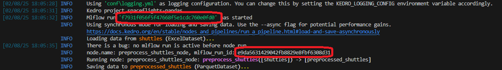

# spaceflights-pandas

This is the default spaceflights-pandas kedro starter, installed with 
```
pip install uv
uv tool install kedro
uvx kedro new -s spaceflights-pandas -n spaceflights-pandas --telemetry no
cd spaceflights-pandas
uv venv
uv pip install -e .
```

I've added a  [custom hook in ``spaceflights_pandas/hooks.py`` which simply starts mlflow](https://github.com/Galileo-Galilei/kedro_mlflow_624/blob/main/src/spaceflights_pandas/hooks.py) and [registered it in ``settings.py``](https://github.com/Galileo-Galilei/kedro_mlflow_624/blob/429aa4a28da094ba5279e79bcd8442d2a939e7e5/src/spaceflights_pandas/settings.py#L9-L12)

## Results

Run the defaut pipeline ith ``kedro run`` and see this surprising result :



Conclusion : the ``after_context_created`` starts running in a different thread the ones where the node run, even whe using sequential runner.